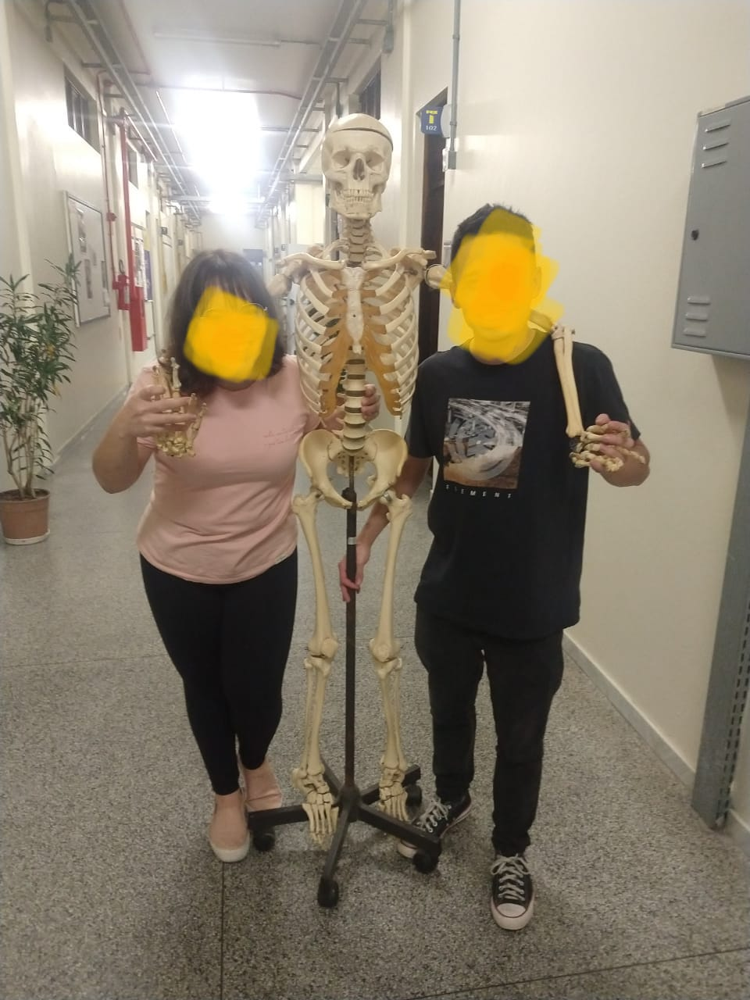

# Unidade 3

Local para postar a atividade da unidade 3.  

## Roteiro de apresentação

### Teórica

Apresentação deve constar:

- [ ] assunto para desenvolver o Projeto da disciplina  
- [ ] lista das funcionalidades  
- [ ] protótipo de telas (no caso pode ser desenhos de "todos" os espaços da aplicação)  
Nesta apresentação se pode utilizar slides, videos, ou mesmo de aplicações que sejam correlatas a ideia proposta para poder exemplificar o Projeto proposto.

### Prática

- [ ] Aplicação de exemplo usando template padrão disponível no Unity Hub: AR Core (AR Foundation)  
- [ ] Aplicação de exemplo usando Vuforia: <https://library.vuforia.com/getting-started/getting-started-vuforia-engine-unity>  
- [ ] Exemplo de aplicações usando o AR no Unity: [UNITY MARS](https://unity.com/products/unity-mars?utm_source=google&utm_medium=cpc&utm_campaign=cc_dd_upr_amer_amer-t2_en_pu_sem-gg_acq_br-pr_2023-01_brand-at2_cc3022_ev-br_id:71700000105927803&utm_content=cc_dd_upr_amer_pu_sem_gg_ev-br_pros_x_npd_cpc_kw_sd_all_x_x_brand_id:58700008262791741&utm_term=unity&&&&&gad=1&gclid=Cj0KCQjwpPKiBhDvARIsACn-gzDSYdMpI7XAajrSRpYlkY6lVhbZs_d9eIY0hurQIra7xM8yYQU95ygaAkadEALw_wcB&gclsrc=aw.ds)  
- [ ] Site da Vuforia para registar marcadores de RA: <https://developer.vuforia.com/vui/develop/databases>  
  - [ ] testar os tipos diferentes de marcadores  
- [ ] Assets da PTC Vuforia na AssetStore: <https://assetstore.unity.com/publishers/24484>  
- [ ] Mostrar quais Assets vai usar para modelar o cenário do projeto:  
  - [ ] <https://assetstore.unity.com/packages/3d/characters/humanoids/humans/human-organ-system-hdrp-175681>  
  - [ ] Mostrar imagem do "Zezinho, o esqueleto"  
    

## Assets Unity

Assets com órgãos.  

<https://assetstore.unity.com/packages/3d/characters/humanoids/humans/skeleton-with-internal-organs-rigged-175142>  

<https://assetstore.unity.com/packages/3d/characters/hq-human-internal-organs-139399>  

### HumanOrganSystem_HDRP

<https://assetstore.unity.com/packages/3d/characters/humanoids/humans/human-organ-system-hdrp-175681>  

[HumanOrganSystem_HDRP.unitypackage](HumanOrganSystem_HDRP.unitypackage)  
